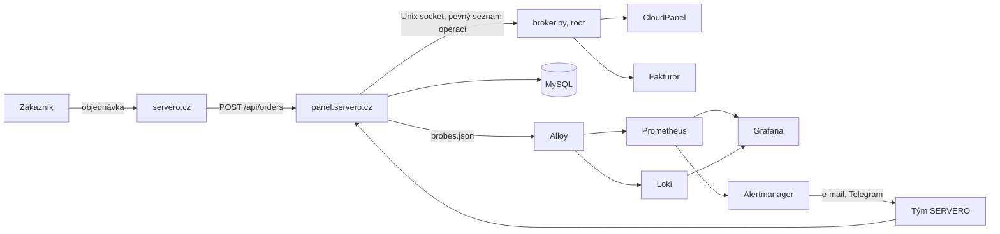
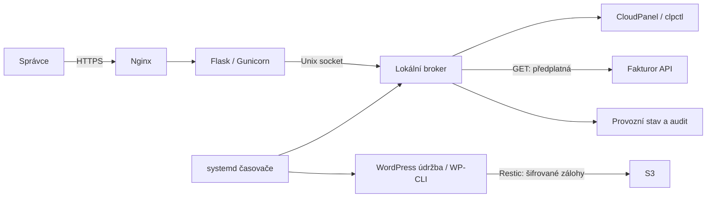

# SERVERO · hosting, servery a klientský panel

[](https://github.com/kunespe/wedos/actions/workflows/tests.yml)

SERVERO přebírá hosting „Vytvořit web“ a nabízí webhosting, spravovaný WordPress, aplikace, spravované VPS a správu serverů. Zřízení dělá člověk do pár hodin, ne automat.

| Část | Kde | Co dělá |
| --- | --- | --- |
| `apps/web` | servero.cz | Prezentace, ceník a objednávkový formulář (statické HTML/CSS/JS) |
| `apps/panel` | panel.servero.cz | Klientská zóna a administrace (SvelteKit 3, MySQL); viz [README](apps/panel/README.md) |
| `catalog/plans.json` | | Jediný zdroj ceníku pro web i panel (CI hlídá, že se shodují) |
| `dashboard/` | | Root broker (`broker.py`), Fakturor adaptér a původní Flask dashboard, dokud ho panel nenahradí |
| `operations/` | | Údržba WordPressů a zálohy přes Restic |
| `ops/` | monitor.servero.cz | Grafana, Prometheus, Loki, Alloy, Alertmanager, nginx, systemd a `deploy.sh`; viz [ops/README](ops/README.md) |
| `docs/` | | [Business case](docs/business-case.md), [runbook objednávky](docs/runbook-objednavka.md), šablony obchodních podmínek, GDPR a SLA |



Nasazení: `ops/deploy.sh` (bez parametrů jen zkušební běh, `--apply` nasadí). Postup prvního nasazení je v [ops/README](ops/README.md).

---

## Původní dashboard (Vytvořit web)

Jedno místo pro správu našich webů, klientských hostingů a provozu serveru.
Dashboard doplňuje **CloudPanel** o klienty, automatizaci WordPressu, zálohy
na S3 a propojení s **Fakturorem**.

Hostování zajišťuje server na Hetzneru. CloudPanel spravuje technickou
konfiguraci webů a dashboard nad ní poskytuje společné rozhraní.
Projekt používá Python, Flask, Nginx a systemd; nevyžaduje placený hostingový panel.

## Funkce a současný stav

| Oblast | Co je připravené | Stav |
| --- | --- | --- |
| Weby a aplikace | Založení WordPress, PHP, statických, Node.js a Bun webů přes CloudPanel | Dostupné; běh aplikací je nutné nastavit samostatně |
| CloudPanel | Sdílený seznam webů a jednorázové přihlášení na kliknutí | Dostupné |
| Provoz | Paměť, disk, služby, runtime verze a historie změn | Dostupné |
| Aktualizace | Kontrola systémových balíčků, runtime verzí a WordPressů | Kontrola bez instalace aktualizací |
| WordPress | Záloha, kontrola dat, aktualizace menších vydání jádra, pluginů a šablon | Čeká na připojené a ověřené S3 |
| Zálohy | Restic, šifrování, S3 a kontrola zpětným stažením | Připravené; AWS úložiště zatím není připojené |
| Fakturor | Předplatná, expirace, přiřazení stabilního ID k webu | Synchronizace každých 10 minut |
| Pozastavení | Ruční pozastavení a obnovení PHP/statických webů | Dostupné; Node/Bun služby zatím nepodporované |
| Vypínání po expiraci | Vyhodnocení platnosti a 7 dní tolerance | Pouze sledování; automatické provedení není aktivované ani napojené |

Stav nasazení zachycený v tomto repozitáři je z **8. října 2026**. Historické
expirace se nejprve opraví ve Fakturoru. Samotná změna příznaku v konfiguraci
nezapíná automatické vypínání webů.

## Jak do sebe části zapadají



Webová část běží pod uživatelem `vw-dashboard`. Broker běží jako root a přes
lokální socket nabízí omezený seznam operací. Dashboard čte seznam webů
CloudPanelu, takže hosting založený v jednom rozhraní se objeví i ve druhém.

Při zakládání WordPressu broker vytvoří web, databázi a instalaci přes WP-CLI.
CloudPanel přístup používá krátkodobý token pro jednorázové přihlášení.

### Fakturor a expirace

Fakturor řeší doklady, platby, upomínky a prodloužení předplatného. Dashboard
čte jeho stav a uchovává **ID předplatného** přiřazené ke konkrétnímu webu.
Název služby není stabilní identifikátor.

- Rozhoduje aktuální platnost služby, nikoliv splatnost jednotlivé faktury.
- `expires_on` je poslední platný den včetně. `expires_at` označuje první
  neplatný okamžik; od něj se počítá **7 kalendářních dní tolerance**.
- Datum i toleranci vyhodnocujeme v `Europe/Prague`, včetně změn letního času.
- Nezaplacená výzva na další období nevypíná stále platný hosting.
- Ruční výjimka z vypínání má přednost před plánovaným pozastavením.
- Chyba API, neplatný klíč nebo neaktuální odpověď zachovává provozní stav.
  Poslední úspěšná data zůstávají jen informativní.

Adaptér nyní **pouze synchronizuje a navrhuje akci**. Pro aktivaci automatických
změn je potřeba doplnit nový úspěšný dotaz před každým vypnutím, provedení
operace přes broker a evidenci důvodu pozastavení. Automatická obnova pak
smí zapnout pouze hosting pozastavený kvůli expiraci, nikoliv ruční blokaci.

`operations/billing-plan.py` je starší samostatný prototyp. Aktivní integrace
Fakturoru používá `dashboard/fakturor.py`.

### WordPress a zálohy

Plánovaná údržba nejprve exportuje databázi a zabalí soubory webu. Po nahrání
šifrované zálohy do S3 ji znovu stáhne přes Restic a porovná SHA-256 obou archivů.
Teprve po úspěšném ověření spouští aktualizace.

Při chybě zálohy, nepřipojeném S3 nebo nedostatku místa se aktualizace
přeskočí. Cílová retence jsou dvě úspěšné zálohy každého webu. Obnova stáhne
archiv do nového adresáře; import databáze a nahrazení živého webu je samostatný
krok správce. Automatický rollback zatím není implementovaný.

## Orientace ve zdrojovém kódu

| Soubor / adresář | Úloha |
| --- | --- |
| [`dashboard/app.py`](dashboard/app.py) | Přihlášení, relace, CSRF a webové routy |
| [`dashboard/broker.py`](dashboard/broker.py) | CloudPanel operace, provozní snapshot, stav a audit |
| [`dashboard/fakturor.py`](dashboard/fakturor.py) | Čtení API, stránkování, ověření odpovědi a vyhodnocení expirace |
| [`dashboard/billing-check.py`](dashboard/billing-check.py) | Spuštění synchronizace přes broker ze systemd |
| [`dashboard/update-check.py`](dashboard/update-check.py) | Kontrola verzí bez instalace balíčků |
| [`dashboard/templates/`](dashboard/templates/) | HTML šablony dashboardu a přihlášení |
| [`dashboard/static/`](dashboard/static/) | CSS a JavaScript |
| [`operations/wp-maintenance.py`](operations/wp-maintenance.py) | Objevování instalací, zálohy a aktualizace WordPressů |
| [`operations/s3-tool.py`](operations/s3-tool.py) | Inicializace, ověření a obnova Restic/S3 |
| [`operations/`](operations/) | systemd jednotky a výchozí vzory konfigurace |
| [`.github/workflows/tests.yml`](.github/workflows/tests.yml) | Testy při pushi a pull requestu |

## Vývoj a testy

Použijte **Python 3.12**. Produkční provoz navíc vyžaduje Linux, systemd,
CloudPanel, Nginx, WP-CLI a Restic. Testy nepotřebují přístup k produkci.

```sh
git clone https://github.com/kunespe/wedos.git
cd wedos
python3 -m venv .venv
.venv/bin/python -m pip install -r dashboard/requirements.txt
.venv/bin/python -m unittest discover -s dashboard -p 'test_*.py' -v
.venv/bin/python -m unittest discover -s operations -p 'test_*.py' -v
```

Testy používají dočasnou konfiguraci a mocky. Ověřují přihlášení a ochranu
webových operací, API expirace a ochrannou lhůtu, stránkování, chování při
chybě, porovnávání verzí i blokování aktualizací při neúspěšné záloze.

GitHub Actions spouští obě sady a kontrolu syntaxe. CI nemá produkční klíče,
nevypíná hostingy a nenasazuje změny na server.

## Nasazení na stávající server

Repozitář zachycuje existující instalaci. Instalace samotného CloudPanelu,
databáze a runtime prostředí je samostatná. Adresy a odkazy v konfiguraci
jsou nyní nastavené pro náš server; před nasazením jinam je upravte.

| Umístění na serveru | Obsah |
| --- | --- |
| `/opt/vw-dashboard/` | Zdroj webu a brokeru; samostatné Python prostředí `venv/` |
| `/etc/vw-dashboard/web.json` | Tajný klíč relací a hash hesla správce |
| `/etc/vytvorit-web/` | Živá konfigurace automatizací a chráněné přístupy |
| `/var/lib/vw-dashboard/` | Stav hostingů, audit, výsledky kontrol a uložené konfigurace |
| `/var/lib/vw-dashboard-web/` | Přihlašovací relace |
| `/run/vw-dashboard/broker.sock` | Lokální socket brokeru, omezený skupinou |
| `/home/clp/htdocs/app/data/db.sq3` | Databáze CloudPanelu, čtená dashboardem |

Web běží jako `vw-dashboard.service` přes Gunicorn na `127.0.0.1:8765`.
Nginx používá konfiguraci [`dashboard/nginx.conf`](dashboard/nginx.conf).
Privilegované operace obsluhuje `vw-dashboard-broker.service`.

Zdroj `operations/wp-maintenance.py` je nasazený jako
`/usr/local/sbin/vytvorit-web-wordpress`; S3 nástroj jako
`/usr/local/sbin/vytvorit-web-s3`. Kontroly a údržbu spouštějí příslušné
systemd služby a časovače v tomto repozitáři.

Při aktualizaci přenášejte pouze potřebný zdrojový kód. **Nepřepisujte živé
klíče, konfiguraci nebo runtime stav výchozími JSON soubory z repozitáře.**
Po změně webu restartujte `vw-dashboard.service`, po změně brokeru
`vw-dashboard-broker.service`. Po změně systemd jednotek použijte
`systemctl daemon-reload`. Není zde automatický deploy.

### Soukromá konfigurace

- `/etc/vw-dashboard/web.json`: `secret_key` a `password_hash` vygenerovaný
  Werkzeugem; přístup jen pro příslušnou službu.
- `/etc/vytvorit-web/fakturor-key`: API klíč Fakturoru; vlastník root, režim 600.
- `/etc/vytvorit-web/s3-backup.json`: vyplněný vzor
  [`operations/s3-backup.json.example`](operations/s3-backup.json.example).
- `/etc/vytvorit-web/restic-password`: samostatné heslo pro šifrování záloh.

Tyto soubory patří mimo veřejný webroot a **nikdy do Gitu**.

## Co repozitář neobsahuje

Hesla, SSH klíče, API klíče, certifikáty, databáze, exporty, zálohy ani klientské
migrace. Kořenový [`.gitignore`](.gitignore) povoluje jen zdroj dashboardu,
provozní skripty, README a CI. Ostatní obsah sdíleného pracovního adresáře
zůstává lokální.
