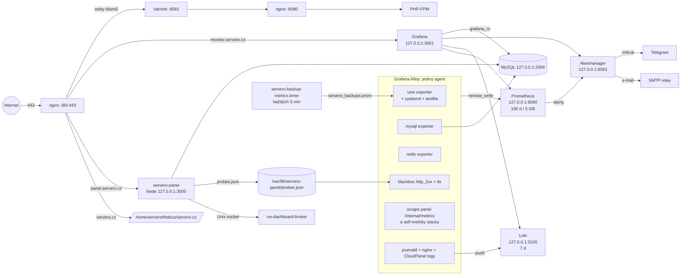

# SERVERO ops: monitoring a nasazení

Provozní vrstva pro server `vytvorit-web` (Hetzner Cloud, 2.31.25.249, Ubuntu 26.04):
monitoring (Grafana, Prometheus, Loki, Alertmanager, Alloy), nginx vhosty pro
`servero.cz`, `panel.servero.cz`, `monitor.servero.cz`, systemd jednotky a skripty
pro instalaci a nasazení. Bez Dockeru: nativní binárky a apt balíčky pod systemd,
každá služba s `MemoryMax`.

Oba skripty jsou ve výchozím stavu **dry run** a nic nemění. Změny dělá až `--apply`.

## Stav nasazení (9. 10. 2026)

| Co | Stav |
| --- | --- |
| `bootstrap-server.sh --apply` | Hotovo: uživatelé `servero` a `servero-panel`, DB `servero_panel`, `/etc/servero-panel/env`, certbot, klíče certifikátů `0600`, ufw |
| ufw | Aktivní: 22, 80, 443/tcp+udp, 8443. Port 8080 a interní porty jsou zvenku zavřené |
| Panel | Běží (`servero-panel.service`), migrace a ceník nahrané, převzaté weby centrumarete.cz a jrmontaze.cz, admin pozván |
| Web servero.cz | Nasazený v `/home/servero/htdocs/servero.cz` |
| Monitoring | Prometheus, Loki, Alloy, Alertmanager, Grafana běží; všechny cíle `up` |
| Certifikáty | Zatím self-signed. `servero-issue-certs.timer` každou hodinu zkusí Let's Encrypt, jakmile DNS ukáže na 2.31.25.249 |

Zbývá:
1. **DNS** u Váš-hosting: `servero.cz`, `www`, `panel`, `monitor` jako A záznam na `2.31.25.249`. Certifikáty pak naskočí samy do hodiny (nebo hned: `systemctl start servero-issue-certs`).
2. **SMTP relay** (port 587; Hetzner blokuje odchozí 25): doplnit `SMTP_URL` v `/etc/servero-panel/env`, `smtp_*` v `alertmanager.yml` a `/etc/alertmanager/secrets/smtp_password`, `GF_SMTP_PASSWORD`. Do té doby panel e-maily jen loguje (`journalctl -u servero-panel`).
3. **Telegram** pro alerty: token do `/etc/alertmanager/secrets/telegram_bot_token` (bez koncového nového řádku) a `chat_id` do `alertmanager.yml`.
4. **Platby**: `SUPPLIER_*`, `PAYMENT_ACCOUNT`, `PAYMENT_IBAN`, `VAT_RATE` v `/etc/servero-panel/env`, pak `systemctl restart servero-panel`.
5. **Heslo MySQL root v CloudPanelu** se během nasazení jednou zobrazilo v pracovním logu; doporučeno ho změnit.

## Architektura



Prometheus sám nic nescrapuje (kromě sebe). Všechny metriky posílá Alloy přes
`remote_write`, logy posílá do Lokiho. Všechny nové služby poslouchají jen na
`127.0.0.1`. Ven jde pouze Grafana přes nginx.

## Soubory

| Cesta v repozitáři | Na serveru | Úloha |
| --- | --- | --- |
| `install-monitoring.sh` | `/opt/servero-ops/` | Idempotentní instalace monitoringu (`--dry-run` / `--apply`) |
| `deploy.sh` | spouští se lokálně | Nasazení webu, panelu a konfigurace (`--dry-run` / `--apply`) |
| `monitoring/prometheus/prometheus.yml` | `/etc/prometheus/` | Prometheus, remote-write receiver, Alertmanager |
| `monitoring/prometheus/rules/servero.rules.yml` | `/etc/prometheus/rules/` | Alerty |
| `monitoring/prometheus/servero.rules.test.yml` | (jen lokálně) | Unit testy alertů pro `promtool test rules` |
| `monitoring/alertmanager/alertmanager.yml` | `/etc/alertmanager/` | Směrování: e-mail, critical i Telegram |
| `monitoring/loki/loki.yml` | `/etc/loki/` | Loki single binary, filesystem, retence 7 dní |
| `monitoring/alloy/config.alloy` | `/etc/alloy/` | Exportery, blackbox, scrape, logy |
| `monitoring/backup-metrics.py` | `/usr/local/sbin/servero-backup-metrics` | Metriky čerstvosti WordPress záloh (textfile) |
| `monitoring/grafana/grafana.ini` | `/etc/grafana/` | 127.0.0.1:3001, bez anonymního přístupu a registrace, SMTP |
| `monitoring/grafana/provisioning/` | `/etc/grafana/provisioning/` | Datasources (Prometheus, Loki, Alertmanager, MySQL) a poskytovatel dashboardů |
| `monitoring/grafana/dashboards/*.json` | `/var/lib/grafana/dashboards/servero/` | Dashboardy: server, MySQL, weby, zálohy, logy, byznys |
| `nginx/00-servero-common.conf` | `/etc/nginx/sites-enabled/` | Rate-limit zóny a websocket `map` (http kontext) |
| `nginx/servero-acme.conf` | `/etc/nginx/sites-enabled/` | Port 80: ACME http-01 a 301 na HTTPS pro všechny SERVERO hosty |
| `nginx/servero.cz.conf` | `/etc/nginx/sites-enabled/` | Statický web, www na apex, gzip, cache, bezpečnostní hlavičky, CSP |
| `nginx/panel.servero.cz.conf` | `/etc/nginx/sites-enabled/` | Proxy na panel, rate limit `/login` a `/api/orders`, `/internal/` je 404 |
| `nginx/monitor.servero.cz.conf` | `/etc/nginx/sites-enabled/` | Proxy na Grafanu včetně Grafana Live websocketu |
| `nginx/servero/*.conf` | `/etc/nginx/servero/` | Sdílené bezpečnostní hlavičky a proxy hlavičky |
| `systemd/*.service`, `*.timer`, `*.service.d/` | `/etc/systemd/system/` | Jednotky a drop-iny s `MemoryMax` |

## RAM rozpočet

Server má 3,7 GiB RAM, aktuálně je volných asi 1,7 GB (kolega uvolňuje další) a 2 GB swapu.

| Služba | MemoryMax | Očekávané běžné využití | Poznámka |
| --- | ---: | ---: | --- |
| Prometheus | 350M | 120 až 200 MB | Pár tisíc sérií; retence 100 d (90denní historie na /stav) nebo 5 GB disku |
| Grafana | 380M | 250 až 270 MB (naměřeno na serveru) | `GOMEMLIMIT=300MiB` |
| Loki | 200M | 80 až 150 MB | `GOMEMLIMIT=170MiB`, embedded cache 2 x 32 MB |
| Alloy | 150M | 70 až 120 MB | `GOMEMLIMIT=120MiB` |
| Alertmanager | 50M | 15 až 25 MB | |
| **Monitoring celkem** | **1000M** | **asi 400 až 650 MB** | |
| servero-panel | 300M | 80 až 150 MB | Node 24, SvelteKit |
| **Nové služby celkem** | **1300M** | **asi 500 až 800 MB** | |

Běžný provoz se do dnešní volné paměti vejde. Součet limitů (1,3 GB) je těsně pod
dostupnou pamětí, proto `install-monitoring.sh` varuje, když je `MemAvailable` pod
900 MiB. Limit chrání ostatní služby: při překročení systemd zabije jen danou
službu a `Restart=on-failure` ji znovu spustí.

## Instalace monitoringu

1. **Certifikát pro `monitor.servero.cz`** (a další hosty, viz níže).
2. Nahrát `ops/` na server (bez reloadu čehokoli kromě nginx konfigurace):
   ```sh
   ops/deploy.sh --only ops            # náhled
   ops/deploy.sh --only ops --apply    # /opt/servero-ops + nginx vhosty s existujícím certifikátem
   ```
3. Na serveru projít náhled a pak instalovat:
   ```sh
   ssh root@2.31.25.249 /opt/servero-ops/install-monitoring.sh            # dry run
   ssh root@2.31.25.249 /opt/servero-ops/install-monitoring.sh --apply
   ```
   Skript přidá apt repozitář `apt.grafana.com` (keyring v `/etc/apt/keyrings/grafana.gpg`,
   ověřený otisk klíče, verze připnuté v `/etc/apt/preferences.d/servero-monitoring.pref`),
   stáhne Prometheus, Alertmanager a Loki z GitHub releases, ověří SHA-256, vytvoří
   uživatele a adresáře, nakopíruje konfiguraci, zvaliduje ji nainstalovanými binárkami
   (`promtool`, `amtool`, `loki -verify-config`, `alloy validate`) a teprve potom služby
   spustí. Opakované spuštění mění jen to, co se liší.
4. **MySQL uživatelé.** Skript vygeneruje hesla a `/etc/servero-monitoring/mysql-users.sql`
   (uživatel `exporter` pro Alloy a `grafana_ro` s `SELECT` jen na `servero_panel.orders`
   a `servero_panel.services`). Spustit jako MySQL admin, až existují tabulky panelu:
   ```sh
   clpctl db:show:master-credentials
   mysql -h 127.0.0.1 -u root -p < /etc/servero-monitoring/mysql-users.sql
   systemctl restart alloy grafana-server
   ```
5. **Tajné údaje** (placeholdery vytvoří skript jednou a nikdy je nepřepíše):
   - `/etc/alertmanager/secrets/smtp_password`, `/etc/alertmanager/secrets/telegram_bot_token`
   - v `monitoring/alertmanager/alertmanager.yml` doplnit `smtp_smarthost`, adresy a `chat_id`
   - `/etc/servero-monitoring/grafana.env`: `GF_SMTP_PASSWORD`; heslo admina Grafany je tamtéž
   - SMTP v `monitoring/grafana/grafana.ini` (`[smtp] host`, `user`)

   Nové projekty na Hetzneru mají blokovaný odchozí port 25, proto relay přes 587.
6. Přihlášení: `https://monitor.servero.cz`, uživatel `admin`, heslo z
   `GF_SECURITY_ADMIN_PASSWORD`. Další správce přidat v Grafaně (registrace je vypnutá).

### Certifikáty

TLS vhosty čekají na `/etc/nginx/ssl-certificates/<doména>.crt` a `.key` (konvence
CloudPanelu). `deploy.sh` vhost bez certifikátu přeskočí s varováním. Port 80 všech
SERVERO hostů obsluhuje `servero-acme.conf`, takže první vydání funguje i bez TLS
vhostu. Výzvy hledá v `/var/www/acme` a potom v kořeni webu `servero.cz`.

Varianta s certbotem (není nainstalovaný, rozhodnout s kolegou):

```sh
apt-get install certbot
certbot certonly --webroot -w /var/www/acme -d monitor.servero.cz \
  --deploy-hook 'install -m 0600 $RENEWED_LINEAGE/privkey.pem /etc/nginx/ssl-certificates/monitor.servero.cz.key;
                 install -m 0644 $RENEWED_LINEAGE/fullchain.pem /etc/nginx/ssl-certificates/monitor.servero.cz.crt;
                 systemctl reload nginx'
```

Pro `servero.cz` jde také Let's Encrypt v CloudPanelu, pokud je web založený jako
statický web CloudPanelu (uživatel `servero`).

## Nasazení (`deploy.sh`)

```sh
ops/deploy.sh                          # dry run všeho: web, panel, ops
ops/deploy.sh --only web               # jen statický web
ops/deploy.sh --apply                  # build panelu, záloha, nasazení, health checky
ops/deploy.sh --apply --only panel --migrate
HOST=root@jiny-server SERVER_IP=1.2.3.4 ops/deploy.sh
```

Dry run:
- `rsync -n --itemize-changes` pro `apps/web/`, panel (`build/`, `package.json`,
  `pnpm-lock.yaml`, `drizzle/`, `scripts/`) a `ops/`,
- `diff -u` živých nginx a systemd souborů proti repozitáři,
- `nginx -t` nad dočasnou kopií živé konfigurace v `/tmp` se staged soubory (logy
  i snippety staged souborů míří do dočasného adresáře, živá konfigurace se nemění),
- health check existujících webů.

`--apply` navíc:
- záloha `/etc/nginx` a `/etc/systemd/system` do `/root/servero-deploy-backups/etc-<čas>.tar.gz`,
- web do `/home/servero/htdocs/servero.cz` (vlastník `servero`),
- panel do `/opt/servero-panel`; po změně `package.json` nebo lockfile spustí na serveru
  `corepack pnpm install --prod --frozen-lockfile` (nativní moduly jako `@node-rs/argon2`
  se musí nainstalovat pro Linux, `node_modules` se z Macu nekopíruje),
- nginx soubory s rollbackem: když `nginx -t` po instalaci selže, vrátí předchozí
  verze a skončí chybou; jinak `systemctl reload nginx`,
- `servero-panel.service`, `daemon-reload`, restart panelu jen při změně kódu nebo jednotky,
- health check `https://centrumarete.cz`, `https://jrmontaze.cz` a nových hostů přes
  `curl --resolve <host>:443:<IP>`, takže funguje i před změnou DNS.

Před prvním spuštěním panelu: `/etc/servero-panel/env` podle `apps/panel/.env.example`,
`chown root:servero-panel`, `chmod 0640`. Bez něj se panel nespustí (deploy varuje).

## Alerty

| Alert | Podmínka | Závažnost |
| --- | --- | --- |
| SiteDown | `probe_success == 0` (http_2xx) 2 min | critical |
| SSLExpiringSoon | certifikát vyprší do 14 dní | warning |
| DomainExpiringSoon / Critical | `servero_domain_expiry_timestamp_seconds` do 30 / 7 dní | warning / critical |
| DiskAlmostFull | obsazeno přes 85 % po 10 min | critical |
| MemoryHigh | využito přes 90 % po 10 min | warning |
| SystemdUnitFailed / NotActive | nginx, mysql, clp-agent, clp-nginx, vw-dashboard-broker, servero-panel, grafana-server, prometheus, loki, alloy, alertmanager | critical / warning |
| BackupStale | poslední úspěšná záloha WordPressu starší než 26 h (při zapnuté údržbě) | warning |
| BackupMetricsStale | textfile se neaktualizoval 15 min | warning |
| MySQLDown, RedisDown | exporter se nepřipojí | critical, warning |
| MonitoringAgentSilent | 5 min bez metrik z Alloye | critical |
| PanelMetricsDown | `/internal/metrics` panelu neodpovídá | warning |

Critical jde e-mailem i na Telegram, warning jen e-mailem.

## Lokální validace

Bez přístupu na server, jen Docker (verze obrazů připnuté):

```sh
cd ops/monitoring
docker run --rm -v "$PWD/prometheus:/w:ro" -w /w --entrypoint promtool prom/prometheus:v3.15.0 check config prometheus.yml
docker run --rm -v "$PWD/prometheus:/w:ro" -w /w --entrypoint promtool prom/prometheus:v3.15.0 check rules rules/servero.rules.yml
docker run --rm -v "$PWD/prometheus:/w:ro" -w /w --entrypoint promtool prom/prometheus:v3.15.0 test rules servero.rules.test.yml
docker run --rm -v "$PWD/alertmanager:/w:ro" --entrypoint amtool prom/alertmanager:v0.34.1 check-config /w/alertmanager.yml
docker run --rm -v "$PWD/loki:/w:ro" grafana/loki:3.7.8 -config.file=/w/loki.yml -verify-config
docker run --rm -v "$PWD/alloy:/w:ro" grafana/alloy:v1.20.1 validate /w/config.alloy
for f in grafana/dashboards/*.json; do jq empty "$f"; done
python3 -m py_compile backup-metrics.py
cd .. && docker run --rm -v "$PWD:/mnt:ro" koalaman/shellcheck:v0.11.0 /mnt/deploy.sh /mnt/install-monitoring.sh
```

`nginx -t` lokálně: obraz `nginx:1.30.0`, minimální `nginx.conf` s `log_format main`
a `include /etc/nginx/sites-enabled/*.conf`, self-signed certifikáty v
`/etc/nginx/ssl-certificates` a `nginx/servero/` připojené do `/etc/nginx/servero`.

## Známá omezení a nejasnosti

- **nginx stub_status se nesbírá.** Alloy nemá nginx exporter a stub_status nevrací
  formát Prometheu. Počty požadavků a 4xx/5xx jsou v dashboardu Logy z access logů
  (label `status_class`). Případně později samostatný `nginx-prometheus-exporter`.
- **BackupStale se rozsvítí hned.** Na serveru zatím nejsou žádné zálohy
  (`/var/backups/vytvorit-web/` je prázdný, S3 není připojené) a `wordpress.json`
  má `enabled: true`. Weby bez zálohy mají `servero_backup_last_success_timestamp_seconds 0`.
  Do připojení S3 lze alert umlčet v Alertmanageru.
- **CloudPanel a `servero.cz.conf`.** Pokud se `servero.cz` založí v CloudPanelu, CloudPanel
  zapíše vlastní `/etc/nginx/sites-enabled/servero.cz.conf`. `deploy.sh` ho přepíše naší
  verzí; úprava vhostu v CloudPanelu nebo jeho Let's Encrypt může soubor znovu přepsat.
  Po takové akci je potřeba `deploy.sh --only ops --apply`.
- **CSP statického webu** povoluje inline skripty (právní stránky je mají). Až se přidá
  Cloudflare Turnstile do objednávky, je potřeba doplnit `https://challenges.cloudflare.com`
  do `script-src` a `frame-src`.
- **Logy webů**: Alloy čte `/home/<uživatel>/logs/*/*.log` díky členství ve skupinách
  uživatelů webů. U nově založeného webu je nutné znovu spustit `install-monitoring.sh --apply`.
- **Panel deploy na serveru** (corepack, `pnpm install --prod`, migrace) nebyl otestovaný
  proti skutečnému serveru; corepack v Node 24 stahuje pnpm z internetu při prvním použití.
- Grafana Alloy 1.20.1 a Grafana 13.2.3 jsou nejnovější vydání z konce září 2026.

## Hardening: návrhy

> **Provést až po domluvě s kolegou.** Nic z toho skripty nedělají.

1. **Hetzner Cloud Firewall**: povolit jen 22, 80 a 443 (TCP i UDP; UDP potřebuje reálně
   jen 443 kvůli QUIC), vše ostatní zahodit. Dnes server firewall nemá.
2. **CloudPanel :8443** omezit na allowlist IP správců ve firewallu, nebo ho zavřít a
   používat SSH tunel: `ssh -L 8443:127.0.0.1:8443 root@2.31.25.249`.
3. **Port 8080** (backend vhosty za Varnishem) poslouchá na `0.0.0.0`. Přepnout `listen 8080`
   na `listen 127.0.0.1:8080` ve vhostech (a ověřit, že šablona CloudPanelu změnu nepřepíše),
   nebo ho aspoň zavřít firewallem.
4. **Uklidit `/root`**: volně leží `cert.pem`, `chain.pem`, `database.sql.gz`, `final.sql.gz`,
   `centrumarete-files.tar.gz` (asi 480 MB), `*-migration-access.json` a další dumpy z migrace.
   Přesunout do šifrované zálohy mimo server a smazat.
5. **Privátní klíče certifikátů** v `/etc/nginx/ssl-certificates/*.key` mají práva `0644`.
   Nastavit `0600 root:root` (nginx master běží jako root).
6. Zvážit `allow`/`deny` pro `monitor.servero.cz` (připravené zakomentované ve vhostu).
